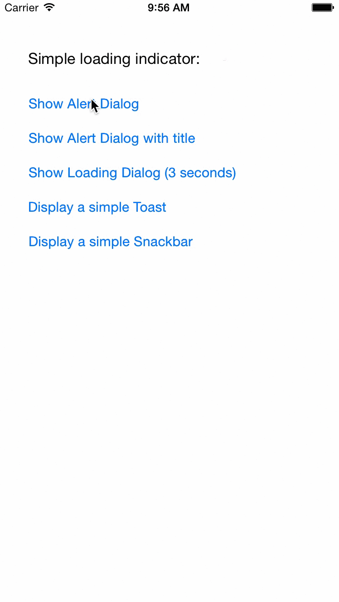

# NBMaterialDialogIOS
NBMaterialDialogIOS contains different dialogs and components used in Material Design by Google, on iOS

[](https://developer.apple.com/swift)
[](http://cocoapods.org/pods/NBMaterialDialogIOS)
[](https://github.com/Carthage/Carthage)
[](https://travis-ci.org/tskulbru/NBMaterialDialogIOS)
[](http://mit-license.org)

## Demo

To run the example project, clone the repo, and run `pod install` from the Example directory first.



## Installation
### CocoaPods

[CocoaPods](http://cocoapods.org) is a dependency manager for Cocoa projects. You can install it with the following command:

```bash
$ gem install cocoapods
```

To integrate NBMaterialDialogIOS into your Xcode project using CocoaPods, specify it in your `Podfile`:

```ruby
source 'https://github.com/CocoaPods/Specs.git'
platform :ios, '8.1'
use_frameworks!

pod 'NBMaterialDialogIOS', '~> 0.3.0'
```

Then, run the following command:

```bash
$ pod install
```

### Carthage

[Carthage](https://github.com/Carthage/Carthage) is a decentralized dependency manager that builds your dependencies and provides you with binary frameworks.

You can install Carthage with [Homebrew](http://brew.sh/) using the following command:

```bash
$ brew update
$ brew install carthage
```

To integrate NBMaterialDialogIOS into your Xcode project using Carthage, specify it in your `Cartfile`:

```ogdl
github "tskulbru/NBMaterialDialogIOS" ~> 0.3.0
```

Run `carthage update` to build the framework and drag the built `NBMaterialDialogIOS.framework` into your Xcode project.

## Swift version support
For swift 3 support, use version `0.3.0` and up. Swift 2 support is no longer maintained, but can still be used. Latest Swift2 supported version is `0.2.3`

## Usage

To set up your own color scheme, set your colors in `NBConfig`

MaterialDialog supports any kind of UIView as its content, so if you want you can provide a scrollview if need be.

More information on how you should use the different components, see the example project.

## Author

Torstein Skulbru

## License

_NBMaterialDialogIOS_ is available under the MIT license. 

> See the [LICENSE file](LICENSE) for more info.
